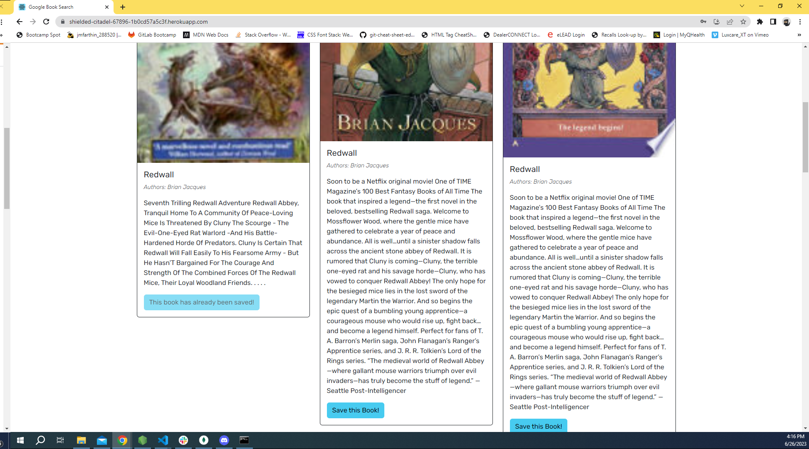
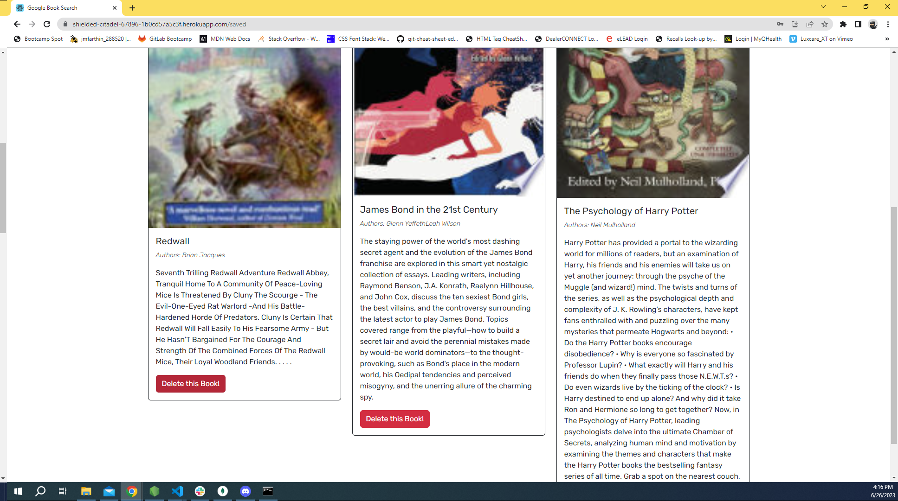

# book-search-engine

This repo contains code for a book search engine.

## Description

This project is a book search engine that allows you to save that book to a user profile, view those saved books, and delete them with persistant storage. It is a refactor with the original functionality provided by a RESTful API that was replaced with GraphQL and Apollo Server and is hosted with Heroku. It's purpose is to showcase my current knowledge of web development and highlight my proficiencies in GraphQL and Apollo Server.

## Usage

To view website, visit: https://shielded-citadel-67896-1b0cd57a5c3f.herokuapp.com/

Repository: https://github.com/jmfarthin/book-search-engine

### Screenshots of deployed website:

# Credits

Thank you to Alex Gonzalez for his help with GraphQL.

## License

Licensed under the general usage MIT license.
Copyright (c) 2023 Justin Farthing
